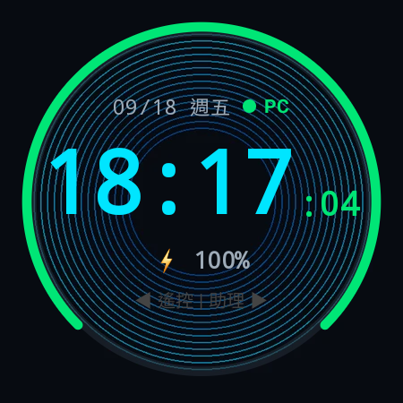
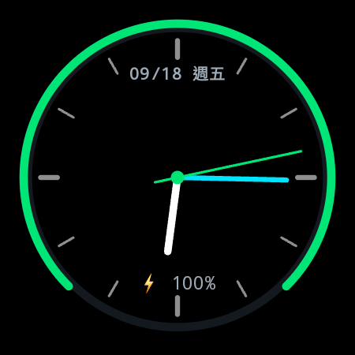
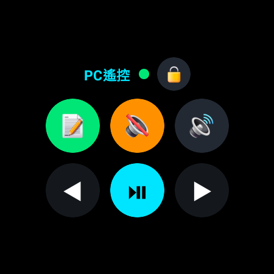

# Kai Launcher for Galaxy Watch 5 Pro (WristHub) ⌚⚡

[](https://developer.android.com/wear)
[](https://www.samsung.com)
[](https://developer.android.com/training/wearables/compose)
[](https://python.org)
[](https://aistudio.google.com)

**WristHub** 是一款專為 **Samsung Galaxy Watch 5 Pro (SM-R925F)** 量身打造的「手腕全能指揮中心／自訂啟動器（Custom Launcher）」。

透過遵循 Android Wear OS 原生架構規範，**完全不需要 Root、刷機或破壞三星 Knox 原廠保固**，即可賦予手錶極具科幻感的 HUD 儀表錶盤、毫秒級延遲的電腦遙控台（支援手錶旋轉外圈邊框調音量），以及**系統級無縫手腕 Gemini 智慧助理（抬腕直接說 + 圓邊光環 + 手錶硬體控制 + 雙模隨身直連）**。

---

## 📸 實機畫面（Galaxy Watch 5 Pro 實拍截圖）

| 🎨 自訂背景 + 數位 HUD | 🕰️ 經典指針模式 (每秒跳動) | 💻 PC 遙控台 (熱映射) |
| :---: | :---: | :---: |
|  |  |  |

---

## 🌟 核心特色功能

### 1. 🤖 系統級 Gemini 手腕全能助理（Siri / Apple Intelligence 級體驗）

從「只能聊天的對話機器人」，徹底進化為**直接掌控手錶硬體與系統 API 的手腕智慧大腦**！

* **⌚ 抬腕直接說（Raise to Speak）**：
  * **0% 微光耗電（Zero AOD Drain）**：螢幕暗下或微光模式時，硬體麥克風完全關閉釋放，零額外耗電。
  * **抬手亮螢幕即說**：進入活躍模式時自動開啟 3.5 秒語音偵測視窗，直接開口說話，**完全不需要喊機器人般的喚醒詞**！若未說話自動釋放麥克風。
  * **雙擊備用手勢**：手錶已亮著時，快速**雙擊錶面任意處**亦可隨時召喚助理。
* **✨ 圓框動態霓虹光環（Bezel Aura Glow）**：
  * 專屬 Galaxy Watch 5 Pro 內凹鈦金屬外框打造的動態 SweepGradient 五色光環。
  * 說話時隨音訊能量即時呼吸膨脹擴散，視覺科技感直接拉滿。
* **🤫 800ms 靜音自動截斷（VAD）**：
  * 內建 16-bit PCM 即時能量分析器，說完話停頓 0.8 秒手錶自動微震一下結束收音，光環於 0.5 秒平滑淡出，全程無需手動點按螢幕。
* **💬 懸浮毛玻璃對話卡片 + 手錶揚聲器 TTS 朗讀**：
  * 頂部浮現極簡思考膠囊，完成後彈出半透明毛玻璃卡片並由手錶實體喇叭唸出回覆，朗讀結束數秒後自動向上收合，時鐘走時全程不中斷。
* **🛠️ 手錶本機硬體控制與 Function Calling**：
  * 🔦 **極致高亮手電筒**：說*「打開手電筒」* ➔ 視窗亮度拉到最大 `1.0f`，全螢幕純白高亮照明，輕觸螢幕任意處立即關閉。
  * ⏱️ **本機倒數計時器**：說*「倒數 3 分鐘」* ➔ 背景倒數，錶面浮現橘色小膠囊 `⏱️ 02:59`，時間到觸發 **3 秒強烈節奏脈衝震動** 與語音通知。
  * ❤️ **即時心率與步數**：說*「我現在心跳多少？」*、*「我今天走幾步了？」* ➔ 零延遲上下文預注入，1 秒內自然回覆即時 PPG 心率與累計步數。
  * 🔋 **電量與續航預估**：說*「手錶還能用多久？」* ➔ 抓取系統 `BatteryManager` 回覆精準剩餘 % 與充電狀態。
  * 🔊 **音量與震動調節**：說*「手錶大聲點」*、*「手錶靜音」*、*「切換震動模式」* ➔ 調節手錶本機音效。
  * ⏰ **設定系統鬧鐘**：說*「設定早上 7 點鬧鐘」* ➔ 自動發送 Android 原生鬧鐘 Intent。
  * 📲 **語音開啟手錶任意 App（Voice App Launcher）**：
    * **抬腕一聲即開**：說*「打開 Spotify」*、*「開啟設定」*、*「打開三星健康」*、*「打開地圖」*、*「開啟天氣」*、*「打開計算機」* 等，手錶秒級直接喚起目標應用程式！
    * **智慧別名與模糊比對**：支援「音樂/聽歌 ➔ Spotify」、「健康/運動 ➔ Samsung Health」、「地圖/導航 ➔ Google Maps」等常用中英文別名對應，並具備拼寫與包容性搜尋。
    * **離線秒開支援**：斷網或離線時，本機正則引擎自動攔截「打開/開啟 xxx」並秒級調用系統 PackageManager 啟動，零等待且不依賴外網。
  * ⌨️ **手腕「無線語音打字機」（Wireless Voice Dictation）**：
    * **自然指令隨時打**：抬腕直接說*「打字：這段程式碼負責連線保活」*、*「輸入：git status」*，Gemini 自動精準萃取文字並毫秒級鍵入至電腦目前焦點游標處（VS Code、Word、記事本、Line 等）。
    * **一鍵極速聽寫模式（Dictation Button）**：PC 遙控頁頂部提供專屬 `⌨️` 聽寫按鈕，點擊進入全自動聽寫，說出的任何內容 100% 直通電腦文字輸入，完全不需前綴詞！
    * **Windows 64 位元剪貼簿貼上注入引擎**：電腦端以 `GlobalAlloc` + `CF_UNICODETEXT` + `Ctrl+V` 事件注入，原生支援繁體中文、英數、標點符號與 Emoji，完美相容 64 位元 Windows 且徹底免疫 Windows UIPI 跨權限阻擋，無論游標停在一般視窗或系統文字框均能即時鍵入。
    * **清脆震動與貼心安靜反饋**：輸入完成手錶微震確認，浮動卡片標註 `⌨️ 已在電腦游標處輸入`，精簡語音朗讀，提供最舒適沉浸的桌面輸入體驗。
  * 🤖 **自我介紹**：說*「你能做什麼？」* ➔ Gemini 生動詳細地逐一介紹其所有本機硬體、健康、工具、手錶 App 開啟與電腦打字遙控能力。
* **🔌 斷網離線正則降級（Offline Fallback Engine）**：
  * 出門無 Wi-Fi、無手機網路時，本機正則比對器直接攔截「手電筒」、「倒數 X 分鐘」、「手錶電量」，**100% 在手錶本機執行**，確保核心工具永不當機。
* **☁️ 雙模智慧路由（Dual-Mode Routing）**：
  * **💻 電腦連線模式**：區網內連線電腦時，優先將語音上傳至電腦端，支援完整的 Windows 硬體指令。
  * **☁️ 隨身直連模式**：出門在外（電腦關機、透過 iPhone/Android 藍牙網路或手錶 Wi-Fi），手錶**自動無縫走 HTTPS 直連 Google Gemini API (`gemini-3.5-flash-lite`)**！
* **🔑 零輸入金鑰同步（Zero-Input Key Sync）**：
  * 在電腦 Web 控制台設定好 Gemini API Key 後，手錶只要連線一次，電腦自動透過 WebSocket 無線推送到手錶本地 `SharedPreferences` 永久保存，免去在手錶小螢幕痛苦輸入金鑰的困擾。

---

### 2. 🎨 高度可自訂義錶面（鎖定畫面級體驗 + 100% 離線優先）
* **大螢幕 Web 視覺化工坊（Watch Face Studio）：**
  * 打開 `http://localhost:8765` 切換至「🎨 錶面自訂工坊」，具備 450x450 圓形實時 WYSIWYG 畫布預覽。
* **個人照片 / 動圖導入（完全無線化）：**
  * 支援上傳任意 JPG、PNG、WebP 或 GIF，電腦後端（Pillow）自動置中裁切、縮放至 450x450，並轉為超省電高壓縮 WebP。
  * 手錶端透過背景協程（Coroutine）將檔案永久下載至 `context.filesDir/custom_bg.webp`。
* **出門 100% 離線可用（Offline-First）：**
  * 斷開電腦或出門在外時，手錶開機瞬間自本地快取載入圖片與配置，基本時鐘、電量弧環、日期、心率、步數功能完整保留。
* **雙時鐘模式：**
  * **數位 HUD 模式**：霓虹色調大字體數位時間、實時秒數。
  * **經典指針模式**：高精度幾何 Canvas 繪製 12 小時刻度、時針、分針與每秒跳動一次的秒針（Tick-Tock）。
* **防眩光暗角濾鏡 (Dim Ratio)**：0%~70% 可調黑底半透明遮罩，確保背景再花俏也能清晰閱讀時間。
* **AOD 微光純黑節能與連線保活機制（Pure Black Ambient & Keep-Alive）：**
  * **AMOLED 零發光純黑熄滅**：垂手進入微光模式時，錶面不渲染任何 UI 元素，呈現純黑 `Color.Black` 畫布。Super AMOLED 像素全滅達到物理級 0% 發光功耗，外觀如完全熄滅，杜絕烙印與光線干擾。
  * **連線保活不中斷**：利用 Wear OS 微光生命週期維持 Activity 前台活躍狀態，避免系統因螢幕真正關閉（Screen-Off）而激進切斷 Wi-Fi 或休眠 CPU，確保手錶與電腦 WebSocket 直連不掉線。
  * **毫秒級即時喚醒**：抬腕瞬間觸發 `onExitAmbient()`，零延遲切回活躍錶盤並立即就緒。
  * **30 秒黃金寬限期**：短暫垂手（< 30 秒）維持原頁面；閒置超過 30 秒抬腕時，**無感靜默重置（Instant Snap）回中央時鐘**。
  * **任務保護（Task Guard）**：AI 錄音中、推理中或語音朗讀中時豁免重置，絕不打斷。

---

### 3. 💻 PC 遙控控制台（左滑分頁 & 電腦端 Web 控制台）
* **本機 Web 控制台（Local Web Dashboard）：**
  * 瀏覽器打開 `http://localhost:8765` 即可進入視覺化管理後台。
  * **動態按鍵映射（Dynamic Mapping）**：在網頁上隨意變更按鈕圖示、名稱、顏色與動作，點擊「儲存並同步」，手錶畫面**秒速熱更新**，完全無需重新編譯 APK！
  * **支援自訂指令（CMD Execution）**：可在電腦控制台上綁定任意指令（如 `notepad.exe`、`calc.exe`、`code .` 或 Python 自動化腳本）。
  * **即時除錯與封包監視器（Live Debugger）**：即時串流顯示手錶點擊延遲（如 `耗時 7.0ms`）、旋轉錶圈 Delta 數值、手錶電池回報與連線狀態。
* **手錶端互動與網路保活：**
  * 🔄 **雙向心跳保活（10s Ping/Pong Keep-Alive）**：手錶端 OkHttp WebSocket 啟用 10 秒週期心跳，防止長期待機時被家用路由器或 NAT 網關切斷閒置連線。
  * 🔇 **一鍵切換靜音**
  * 🔊 **音量增加** / 🔉 **音量減少**
  * ⏯️ **媒體播放 / 暫停**
  * ◀ **簡報上一頁** / ▶ **簡報下一頁**（PPT 翻頁器）
  * 🔒 **一鍵鎖定 Windows 電腦**（`Win + L`）
  * **旋轉外圈（Rotary Bezel）支援：** 手指在 Watch 5 Pro 螢幕外圈滑動觸碰邊框，可平滑調節電腦音量！
  * **線性馬達觸覺震動（Haptic Feedback）：** 每次按鍵均提供清脆的觸覺反饋。

---

### 4. ⚡ 圓形螢幕極致切換效能優化
* **精簡雙頁架構：**
  * 手錶 Pager 優化為最乾淨的 2 頁：`左：PC 遙控器` ⟷ `中：HUD 時鐘錶面`，助理升級為全局浮動。
* **60FPS 流暢切換：**
  * 移除每幀強制觸發 GPU 離屏合成的 `saveLayer` 記憶體停頓，採用圓形黑膠唱片裁切與 3D 景深縮放，滑動幀率穩定貼滿 60FPS。
* **Windows 桌面一鍵雙開捷徑：**
### 5. 📱 原生級 Launcher 基礎建設：App Drawer、原生多工相容與雙重首頁保護
* **應用程式抽屜 (App Drawer Overlay)：**
  * **手勢喚醒**：在 HUD 錶盤向上滑動（或點擊底部青色微光小箭頭）平滑展開抽屜。
  * **Wear OS 圓形曲面視覺**：採用 Wear OS `ScalingLazyColumn`，滑動時具備微縮魚眼曲率縮放，極致貼合手錶圓形螢幕。
  * **自身隔離保證**：動態獲取手錶安裝的所有應用，**嚴格過濾排除 `com.wristhub.launcher`**，絕不出現在抽屜內。
  * **智慧排序與 IO 預快取**：
    * 頂部置頂「🌟 常用推薦」前 3 項最常開啟或最近開啟的 App。
    * 下方依名稱 A~Z 字母順序排序。
    * 圖標於背景 IO 執行緒預先轉換為 Bitmap 快取，滑動保持絲滑 60FPS。
  * **🔄 雙軌虛擬圓周錶圈輪轉 (Dual-Track Rotary Touch Bezel)**：
    * **外圈圓周滑動手勢**：手指貼著 Galaxy Watch 5 Pro 凸起的鈦金屬內凹外框邊緣畫圓，順時針向下滾動、逆時針向上滾動，視野完全不被大拇指遮擋！
    * **機械齒輪微震動 (Haptic Click Wheel)**：每轉動約 7 度觸發一次清脆的線性馬達刻度微震，帶來如同實體機械旋轉錶圈的咔嗒節奏反饋。
    * **外緣動態發光弧線 (Bezel Glow Arc)**：手指沿外圈旋轉時，螢幕邊緣亮起賽博青色霓虹弧光跟隨手指軌跡，鬆手平滑淡出。
    * **角速度非線性加速**：滑動速度越快位移等比放大（1.0x ~ 3.5x），長清單直達底部省力又高效。
    * **相容原廠 Touch Bezel**：同時支援 Wear OS 系統原生 `onRotaryScrollEvent` 雙軌並行。
  * **🔤 浮動區段字母氣泡 (Alphabet Indicator)**：轉動與滑動時外緣浮現半透明青色發光膠囊（如 `⭐ 常用`、`A`、`S`、`W`），即時掌握當前字母區間。
  * **🔝 點擊一鍵秒回頂部 (Tap-to-Top)**：點擊頂部「APPS (數量)」徽章，平滑動畫瞬移滾回最頂端「常用推薦」。
  * **動態安裝感應**：註冊系統 `BroadcastReceiver`，新安裝或移除 App 即時自動刷新清單。
* **三星原生多工與近期應用相容 (Samsung Native Recents Integration)：**
  * **原生連按雙擊 Back 鍵**：手錶端可直接透過三星系統設定（「設定」>「進階功能」>「自訂按鍵」>「連按兩次返回鍵」設為「顯示近期應用程式」），隨時檢視近期 App 並釋放記憶體。
  * **啟動器自身隱形防護 (`android:excludeFromRecents="true"`)**：WristHub Launcher 宣告排除在 Recent Apps 之外，多工清單中絕對不會出現自身 Launcher，保持純淨不干擾。
  * **按鍵完全讓渡系統**：完全無底層按鍵攔截衝突，流暢呼叫系統級近期應用與背景清理。
* **雙重首頁保護與防退 (Dual Home Protection)：**
  * **第三方 App 返回防護**：開啟 App 皆帶有 `FLAG_ACTIVITY_NEW_TASK or FLAG_ACTIVITY_RESET_TASK_IF_NEEDED`，按下返回鍵或關閉 App 後無縫回到 WristHub Launcher。
  * **永不退出**：在 Compose 與 Activity 層級全面攔截返回鍵，在錶盤按下返回鍵絕不退出。
  * **超時微光自動回歸**：進入 Ambient 微光睡眠超過 30 秒，抬腕喚醒時自動重置回歸 HUD 錶盤第一頁，並自動關閉所有開啟的抽屜與覆蓋層。
  * **精確喚醒無誤觸**：切換 App 或返回首頁時不觸發 Gemini 語音，僅在真正抬腕亮螢幕時啟動語音偵測視窗。

---

## 🔒 安全性與隱私聲明 (Security & Privacy)

1. **純區域網路通訊（Local Only）：** 手錶與電腦之間的 WebSocket 預設僅在家庭/工作區網直連傳輸，不經過任何第三方雲端伺服器。
2. **無敏感個人資料（No Secrets Committed）：** `.gitignore` 嚴密排除 API 金鑰（`gemini_api_key` 僅保存在本機 `config.json` 與手錶本地加密 SharedPreferences，絕不上傳公開倉庫）。
3. **系統無損保證（Non-invasive Architecture）：** 程式為標準 Wear OS App，完全不影響 Knox 保固與手錶原廠健康功能。

---

## 🛠️ 專案架構

```text
wrist-hub/
├── app/                            # Wear OS 手錶端 Android 專案
│   ├── src/main/
│   │   ├── java/com/wristhub/launcher/
│   │   │   ├── audio/                     # 音訊處理與抬腕監聽
│   │   │   │   ├── VoiceActivityDetector.kt # 輕量 RMS 800ms 靜音截斷器
│   │   │   │   ├── WakeAssistantManager.kt  # 抬腕 3.5s 監聽與全域助理生命週期
│   │   │   │   ├── WavUtils.kt             # 16-bit PCM 轉標準 WAV 工具
│   │   │   │   ├── AudioRecorderManager.kt # 麥克風錄音管理
│   │   │   │   └── WatchTtsManager.kt      # 全局單例 TextToSpeech 揚聲器預熱
│   │   │   ├── data/                      # 資料模型
│   │   │   │   └── AppItem.kt              # 安裝應用與多工項目資料類別
│   │   │   ├── hardware/                  # 手錶本機硬體與系統調用
│   │   │   │   ├── WatchHardwareManager.kt # 手電筒、音量/震動、電池、心率、步數
│   │   │   │   ├── WatchTimerManager.kt    # 本機倒數計時器與脈衝震動警報
│   │   │   │   └── OfflineIntentMatcher.kt # 斷網離線正則關鍵字比對引擎
│   │   │   ├── manager/                   # Launcher 核心管理器
│   │   │   │   ├── AppDrawerManager.kt     # 應用清單掃描、動態廣播、常用推薦快取
│   │   │   │   └── TaskManager.kt          # 多工追蹤、背景清理、白名單防護
│   │   │   ├── presentation/
│   │   │   │   ├── MainActivity.kt        # 生命週期、AOD 寬限期、原生首頁保護與返回防護
│   │   │   │   ├── WristHubApp.kt         # 60FPS 雙頁 Pager（PC 遙控 ⟷ HUD 錶盤）與 Drawer 路由
│   │   │   │   ├── components/            # UI 視覺特效元件
│   │   │   │   │   ├── AppDrawerOverlay.kt  # Wear OS 圓形魚眼曲面抽屜與推薦欄
│   │   │   │   │   ├── GeminiAuraOverlay.kt # Apple Intelligence 風格圓邊光環
│   │   │   │   │   ├── FloatingReplyCard.kt # 毛玻璃懸浮對話卡片與膠囊
│   │   │   │   │   ├── FlashlightOverlay.kt # 全螢幕純白 1.0f 極致手電筒
│   │   │   │   │   └── TimerBadge.kt        # 錶面倒數計時橘色小膠囊
│   │   │   │   ├── screens/               # HUD 錶盤與 PC 遙控介面
│   │   │   │   └── theme/                 # 科幻 HUD 霓虹色系配色
│   │   │   └── network/
│   │   │       ├── PcWebSocketManager.kt  # OkHttp WebSocket 客戶端與金鑰同步
│   │   │       └── AiSyncManager.kt       # 雙模路由（PC轉發 / HTTPS直連Gemini）
│   │   ├── res/                           # 圖示、字串與資源
│   │   └── AndroidManifest.xml            # 錄音、震動、網路、QUERY_ALL_PACKAGES、HOME 啟動器宣告
│   └── build.gradle.kts
├── pc-daemon/                      # 電腦端 Python 守護程式
│   ├── wrist_server.py             # FastAPI / WebSocket / Gemini API 伺服器
│   ├── launch_web.py               # 一鍵啟動守護進程與瀏覽器
│   ├── index.html                  # 視覺化 Web 控制台（按鍵/錶盤/AI 管理）
│   ├── config.json                 # 按鍵映射與本機 AI 配置（含 gitignore 保護）
│   └── watchface_config.json       # 錶盤自訂樣式設定
├── docs/images/                    # 手錶實拍截圖
├── .gitignore                      # 嚴格過濾構建與隱私金鑰
└── settings.gradle.kts
```

---

## 🚀 快速開始指南

### 1. 前置需求
* **電腦端：** Windows 10/11，已安裝 Python 3.10+、Android Studio 與 Android SDK Platform-Tools（adb）。
* **手錶端：** Samsung Galaxy Watch 4 / 5 / 5 Pro / 6 / 7 等運行 Wear OS 3.0+ 之裝置。

### 2. 手錶 Wi-Fi ADB 配對與連線
1. 手錶開啟 **「設定」➔「關於手錶」➔「軟體資訊」➔ 連續點擊「軟體版本」數次**，開啟開發人員選項。
2. 進入 **「設定」➔「開發人員選項」**，開啟 **「ADB 偵錯」** 與 **「無線偵錯」**。
3. 點選「使用配對碼配對新裝置」，在電腦終端機輸入：
   ```powershell
   adb pair <手錶IP>:<配對連接埠> <6位配對碼>
   ```
4. 配對完成後，連線至主連接埠：
   ```powershell
   adb connect <手錶IP>:<主要連接埠>
   ```

### 3. 啟動電腦端 Python 守護程式
安裝相依套件：
```powershell
pip install fastapi uvicorn websockets pillow imageio
```
**啟動方式（二選一）：**
* **方法 A（推薦・一鍵雙開）**：直接雙擊桌面捷徑 **`WristHub 控制台.lnk`**（或執行 `python pc-daemon/launch_web.py`），將自動常駐伺服器並秒開瀏覽器後台。
* **方法 B（命令列啟動）**：
  ```powershell
  python pc-daemon/wrist_server.py
  ```

### 4. 設定 Gemini AI 手腕助理（自動無線同步金鑰）
1. 電腦瀏覽器打開 `http://localhost:8765`。
2. 切換至 **「🤖 Gemini AI 設定」** 頁籤。
3. 貼上您的 [Google AI Studio API Key](https://aistudio.google.com/apikey)（免費），模型選擇 **`Gemini 3.5 Flash Lite (最推薦 ⭐)`**，點擊 **「💾 儲存 AI 設定」**。
4. 電腦會**自動透過 WebSocket 將金鑰推送至手錶 SharedPreferences**，出門在外即使離線無電腦，手錶依然具備直連 Google 獨立運算能力！

### 5. 編譯並安裝手錶 App
在專案根目錄執行 Gradle 編譯並推送至手錶：
```powershell
./gradlew assembleDebug
adb install -r app/build/outputs/apk/debug/app-debug.apk
```
啟動手錶 App：
```powershell
adb shell am start -n com.wristhub.launcher/.presentation.MainActivity
```

---

## 💡 推薦設定：設定手錶實體按鈕秒開 WristHub

1. 手錶開啟 **「設定」➔「進階功能」➔「自訂按鍵」**。
2. 找到 **「按兩次（首頁鍵）」**。
3. 在清單中勾選 **`Wrist Hub`**。
4. 設定完成後，在任何畫面**連續按兩次右上角實體鍵**即可瞬間喚醒進入指揮中心！

---

## 📄 License
MIT License
