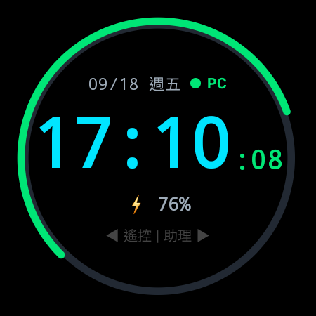
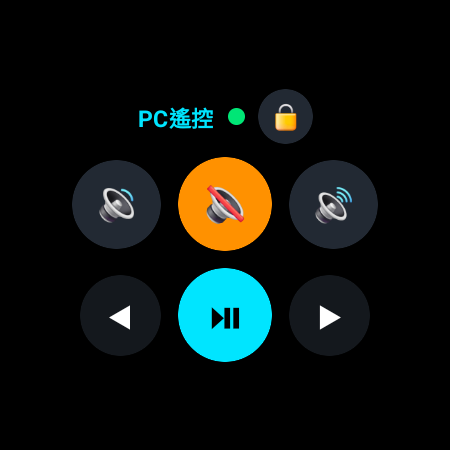
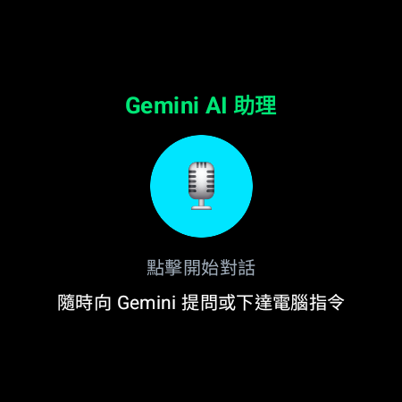

# Kai Launcher for Galaxy Watch 5 Pro (WristHub) ⌚⚡

[](https://developer.android.com/wear)
[](https://www.samsung.com)
[](https://developer.android.com/training/wearables/compose)
[](https://python.org)

**WristHub** 是一款專為 **Samsung Galaxy Watch 5 Pro (SM-R925F)** 量身打造的「手腕全能指揮中心／自訂啟動器（Custom Launcher）」。

透過遵循 Android Wear OS 原生架構規範，**完全不需要 Root、刷機或破壞三星 Knox 原廠保固**，即可賦予手錶極具科幻感的 HUD 儀表錶盤、毫秒級延遲的電腦遙控台（支援手錶旋轉外圈邊框調音量），以及手腕 AI 語音助理介面。

---

## 📸 實機畫面（Galaxy Watch 5 Pro 實拍截圖）

| ⌚ 自訂 HUD 數位錶盤 | 💻 PC 遙控控制台（已連線） | 🤖 Gemini AI 語音助理 |
| :---: | :---: | :---: |
|  |  |  |

---

## 🌟 核心特色功能

### 1. ⌚ 科幻 HUD 數位錶盤（主頁面）
* **極致省電：** 採用 AMOLED 純黑底色設計，最小化像素耗電。
* **外圈弧形電量計：** 動態色彩顯示（綠/橙/紅），即時追蹤手錶 590mAh 電池百分比。
* **連線狀態指示燈：**
  * `🟢 PC`：與電腦端 WebSocket 服務連線正常。
  * `🔴 OFF`：尚未連線至電腦。
* **微光常亮模式（AOD / Ambient Mode）：** 支援 `AmbientLifecycleObserver`，手放下時自動進入黑白低更新率省電模式，手錶抬起立即恢復全彩全功能，不被系統強制退出。

### 2. 💻 PC 遙控控制台（左滑分頁）
* **零延遲通訊：** 透過區域網路 Wi-Fi WebSocket 保持小於 15ms 響應。
* **系統與多媒體控制：**
  * 🔇 **一鍵切換靜音**
  * 🔊 **音量增加** / 🔉 **音量減少**
  * ⏯️ **媒體播放 / 暫停**
  * ◀ **簡報上一頁** / ▶ **簡報下一頁**（PPT 翻頁器）
  * 🔒 **一鍵鎖定 Windows 電腦**（`Win + L`）
* **旋轉外圈（Rotary Bezel）支援：** 手指沿著 Watch 5 Pro 螢幕外圈滑動觸碰邊框，可平滑調節電腦音量！
* **線性馬達觸覺震動（Haptic Feedback）：** 每次按鍵均提供清脆的觸覺反饋。

### 3. 🤖 Gemini AI 隨身助理（右滑分頁）
* 手腕隨身錄音按鈕與對話卡片，支援語音下達指令與接收文字/語音摘要。

---

## 🔒 安全性與隱私聲明 (Security & Privacy)

本專案遵循資安與隱私保護原則：
1. **純區域網路通訊（Local Only）：** 手錶與電腦之間的 WebSocket 預設僅在家庭/工作區網（如 `192.168.0.x`）直連傳輸，不經過任何第三方雲端伺服器，避免指令被竊聽。
2. **無敏感個人資料（No Secrets Committed）：** `.gitignore` 已嚴密過濾本機 SDK 路徑（`local.properties`）、金鑰證書（`*.jks`, `*.keystore`）與未來之 API 金鑰設定檔。
3. **系統無損保證（Non-invasive Architecture）：** 程式為標準 Wear OS App，不侵入 bootloader，隨時可安全解除安裝，不影響 Samsung Pay、Samsung Health 等 Knox 安全組件。

---

## 🛠️ 專案架構

```text
wrist-hub/
├── app/                            # Wear OS 手錶端 Android 專案
│   ├── src/main/
│   │   ├── java/com/wristhub/launcher/
│   │   │   ├── presentation/
│   │   │   │   ├── MainActivity.kt        # 主入口、Ambient 微光常亮監聽
│   │   │   │   ├── WristHubApp.kt         # HorizontalPager 多頁容器
│   │   │   │   ├── screens/               # HUD 錶盤、PC 遙控、AI 介面
│   │   │   │   └── theme/                 # 科幻 HUD 霓虹色系配色
│   │   │   └── network/
│   │   │       └── PcWebSocketManager.kt  # OkHttp WebSocket 客戶端
│   │   ├── res/                           # 圖示、字串與資源
│   │   └── AndroidManifest.xml            # 權限、HOME 啟動器宣告
│   └── build.gradle.kts
├── pc-daemon/                      # 電腦端 Python 守護程式
│   └── wrist_server.py             # 監聽 WebSocket 並模擬鍵鼠 (Win32 API)
├── docs/images/                    # 手錶實拍截圖
├── .gitignore                      # 嚴格過濾構建與隱私檔案
└── settings.gradle.kts
```

---

## 🚀 快速開始指南

### 1. 前置需求
* **電腦端：** Windows 10/11，已安裝 Python 3.10+、Android Studio 與 Android SDK Platform-Tools（adb）。
* **手錶端：** Samsung Galaxy Watch 4 / 5 / 5 Pro / 6 / 7 等運行 Wear OS 3.0+ 之裝置。

### 2. 手錶 Wi-Fi ADB 配對與連線
1. 手錶開啟 **「設定」➔「關於手錶」➔「軟體資訊」➔ 連續點擊「軟體版本」數次**，開啟開發人員選項。
2. 進入 **「設定」➔「開發人員選項」**，開啟 **「ADB 偵錯」** 與 **「無線偵錯」**。
3. 點選「使用配對碼配對新裝置」，在電腦終端機輸入：
   ```powershell
   adb pair <手錶IP>:<配對連接埠> <6位配對碼>
   ```
4. 配對完成後，連線至主連接埠：
   ```powershell
   adb connect <手錶IP>:<主要連接埠>
   ```

### 3. 啟動電腦端 Python 守護程式
安裝 WebSocket 依賴：
```powershell
pip install websockets
```
啟動伺服器：
```powershell
python pc-daemon/wrist_server.py
```
*(伺服器將在 `0.0.0.0:8765` 監聽來自手錶的指令)*

### 4. 編譯並安裝手錶 App
在專案根目錄執行 Gradle 編譯並推送至手錶：
```powershell
./gradlew assembleDebug
adb install -r app/build/outputs/apk/debug/app-debug.apk
```
啟動手錶 App：
```powershell
adb shell am start -n com.wristhub.launcher/.presentation.MainActivity
```

---

## 💡 推薦設定：設定手錶實體按鈕秒開 WristHub

1. 手錶開啟 **「設定」➔「進階功能」➔「自訂按鍵」**。
2. 找到 **「按兩次（首頁鍵）」**。
3. 在清單中勾選 **`Wrist Hub`**。
4. 設定完成後，在任何畫面**連續按兩次右上角實體鍵**即可瞬間喚醒進入指揮中心！

---

## 📄 License
MIT License
